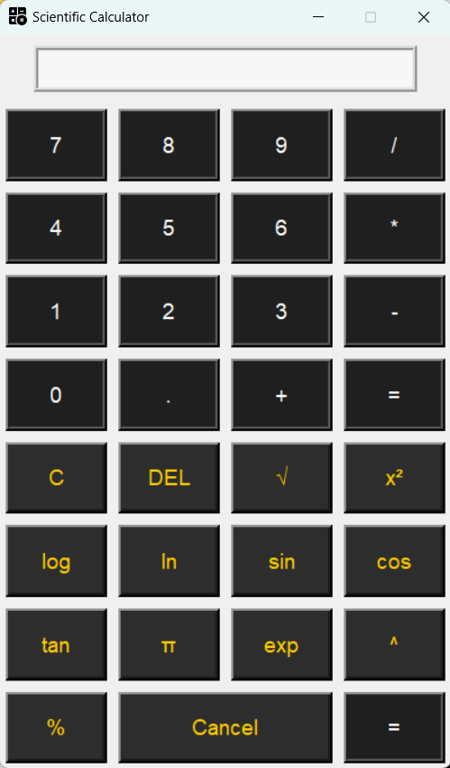

Here’s the updated `README.md` file with the corrected screenshot path and other adjustments:

```markdown
# Scientific Calculator

## Overview

This project is a Scientific Calculator built using Python's Tkinter library. The application provides basic and advanced mathematical operations, including:

- Arithmetic operations (addition, subtraction, multiplication, division)
- Square root
- Square
- Logarithms (base 10 and natural)
- Trigonometric functions (sine, cosine, tangent)
- Exponential function
- Pi constant
- Power and modulus operations

The application has a user-friendly graphical interface and supports various scientific calculations.

## Features

- **Basic Arithmetic**: Addition, subtraction, multiplication, and division.
- **Scientific Functions**: Square root, square, logarithms (log and ln), trigonometric functions (sin, cos, tan), exponential function, and power operation.
- **User Interface**: Intuitive and responsive layout with buttons for each operation.

## Installation

1. **Install Dependencies**:
   Ensure you have Python installed. Install the required packages using pip:
   ```bash
   pip install tk
   ```

2. **Run the Application**:
   To run the application directly from the source code, use:
   ```bash
   python calculator.py
   ```

## Packaging as a Standalone Executable

To distribute the application as a standalone Windows executable, PyInstaller has been used. Follow these steps to package the application:

1. **Install PyInstaller**:
   Ensure PyInstaller is installed. You can install it via pip if you don't have it already:
   ```bash
   pip install pyinstaller
   ```

2. **Package the Application**:
   Use the following PyInstaller command to create a standalone executable:
   ```bash
   pyinstaller --onefile --icon=calculator.ico calculator.py
   ```

   - `--onefile`: Creates a single executable file.
   - `--icon=calculator.ico`: Sets the icon for the executable.
   - `calculator.py`: The script to be packaged.

3. **Find the Executable**:
   After running the command, the executable file will be located in the `dist` directory within your project folder.

## Usage

- **Open the Application**: Double-click the `calculator.exe` file in the `dist` directory.
- **Perform Calculations**: Use the calculator interface to input numbers and operations, and press "=" to get results.

## Screenshots



## Acknowledgements

- Tkinter for creating the graphical user interface.
- PyInstaller for packaging the application into a standalone executable.

## Contact

For any questions or feedback, please reach out to [daharupesh21@gmail.com](mailto:daharupesh21@gmail.com).

---

**Note**: Ensure that you have the `calculator.ico` file in the same directory as `calculator.py` when running PyInstaller.
```

### Updates in the README:

- **Screenshots Section**: Updated the path to `Image/output.png`.
- **Contact**: Updated the contact email address to your provided email.

Feel free to adjust any additional details as needed!
